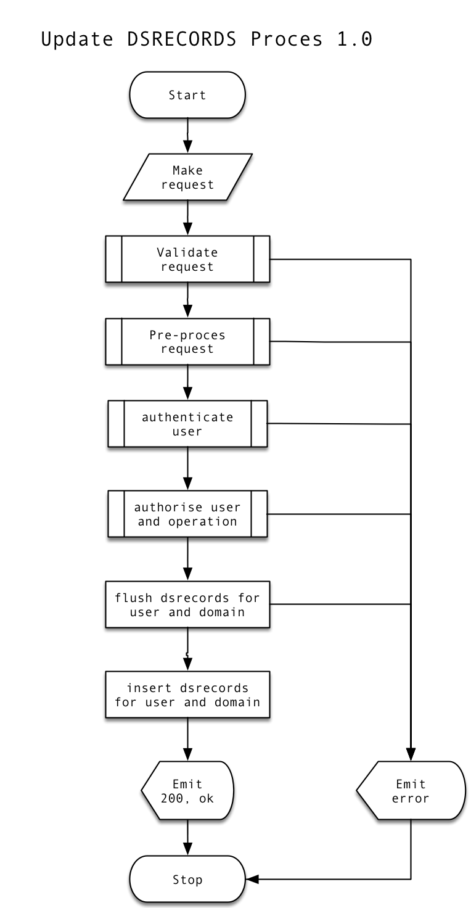
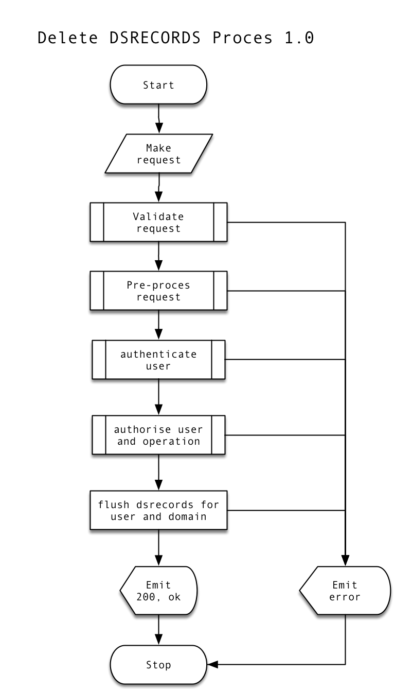

# DSU Service and Protocol 1.0 Specification

<!-- MarkdownTOC -->

- [Introduction](#introduction)
- [About this Document](#about-this-document)
	- [License](#license)
	- [Document History](#document-history)
- [The .dk Registry in Brief](#the-dk-registry-in-brief)
- [The DS Update Service](#the-ds-update-service)
	- [Encoding](#encoding)
	- [Security](#security)
	- [Parameters](#parameters)
		- [`userid`](#userid)
		- [`password`](#password)
		- [`domain`](#domain)
	- [Supported Algorithms](#supported-algorithms)
	- [Supported Digest Types](#supported-digest-types)
- [DS Service Features](#ds-service-features)
	- [Adding DS-keys](#adding-ds-keys)
	- [Example 1](#example-1)
		- [Using curl](#using-curl)
		- [Using httpie](#using-httpie)
	- [Deleting DS-keys](#deleting-ds-keys)
	- [Example 2](#example-2)
		- [Using curl](#using-curl-1)
		- [Using httpie](#using-httpie-1)
- [References](#references)
- [Resources](#resources)
	- [Mailing list](#mailing-list)
	- [Issue Reporting](#issue-reporting)
	- [Demo Client](#demo-client)
- [Appendices](#appendices)
	- [HTTP Status Codes](#http-status-codes)
	- [HTTP Sub-status Codes](#http-sub-status-codes)

<!-- /MarkdownTOC -->

<a id="introduction"></a>
# Introduction

DSU is short for DS Update. DSU is a proprietary protocol and service developed and offered by DK Hostmaster as an interface for updating DNSSEC related DS records associated with a .dk domain name.

The protocol is based on HTTP and the parameters are transferred as POST-variables. The response contains an HTTP header and a brief message for human interpretation. The interface interprets a call as an atomic operation. If errors occur, all changes are rejected and no existing DS records are deleted.

To use DSU, send a TLS-encrypted HTTP POST request to the following address:

```
https://dsu.dk-hostmaster.dk/1.0
```

For experimentation and development, DK Hostmaster offers a sandbox at the following address:

```
https://dsu-sendbox.dk-hostmaster.dk/1.0
```

<a id="about-this-document"></a>
# About this Document

This specification describes protocol version 1.0.

Printable version can be obtained via [this link](https://gitprint.com/DK-Hostmaster/dsu-service-specification/blob/master/README.md), using the gitprint service.

<a id="license"></a>
## License

This document is copyright by DK Hostmaster A/S and is licensed under the MIT License, please see the separate LICENSE file for details.

<a id="document-history"></a>
## Document History

* 1.4 2018-06-07
  * Added proces diagrams
  * Added `httpie` and `curl` examples

* 1.3 2018-06-07
  * Updated DNSSEC information 

* 1.2 2017-04-01
	* Addressed broken links
	* Added information on algorithms 13 and 14 [RFC:6605][RFC6605] 
	* Added information on digest type 4 [RFC:6605][RFC6605]
	* Added list of supported algorithms and digest types 

* 1.1 2016-06-29
	* Added more information and extended the documentation with license, TOC etc.

* 1.0 2015-07-04
	* Initial revision on Github

<a id="the-dk-registry-in-brief"></a>
# The .dk Registry in Brief

DK Hostmaster is the registry for the ccTLD for Denmark (dk). The current model used in Denmark is based on a sole registry, with DK Hostmaster maintaining the central DNS registry.

The service is not subject to any sorts of standards.

<a id="the-ds-update-service"></a>
# The DS Update Service

<a id="encoding"></a>
## Encoding

Non-ASCII parameters is first tried interpreted as UTF-8. If this fails, data are assumed to be ISO8859-1.

<a id="security"></a>
## Security

<a id="parameters"></a>
## Parameters

The following parameters are part of the protocol:

<a id="userid"></a>
### `userid`

This userid must be authorised to operate on the DS keys for the given domain name.

<a id="password"></a>
### `password`

This is the password for the given `userid`.

<a id="domain"></a>
### `domain`

The domain name which this DS Update pertains. The domain name is transferred encoded using punycode. This means domain name containing Danish letters should be written using the `xn--` notation, just as for DNS. For allowed characters please see [the DK Hostmaster Name Service specification][DKHMDNSSPEC].

<a id="supported-algorithms"></a>
## Supported Algorithms

DK Hostmaster currently support the following algorithms from the [IANA algorithm listing][IANA algorithm listing]:

- 3 DSA (DSA/SHA1) [RFC:3110][RFC3110] - _do note that use of this algorithm is not recommended since it is deprecated_
- 5 RSASHA1 (RSA/SHA-1) [RFC:2539][RFC2539]
- 6 DSA-NSEC3-SHA1 (DSA-NSEC3-SHA1) [RFC:5155][RFC5155]
- 7 RSASHA1-NSEC3-SHA1 (RSASHA1-NSEC3-SHA1) [RFC:5155][RFC5155]
- 8 RSA/SHA-256 [RFC:5702][RFC5702]
- 10 RSA/SHA-512 [RFC:5702][RFC5702]
- 13 ECDSA Curve P-256 with SHA-256 [RFC:6605][RFC6605]
- 14 ECDSA Curve P-384 with SHA-384 [RFC:6605][RFC6605]

<a id="supported-digest-types"></a>
## Supported Digest Types

- 1 SHA-1 [RFC:4509][RFC4509]
- 2 SHA-256 [RFC:4509][RFC4509]
- 4 SHA-384 [RFC:6605][RFC6605]

<a id="ds-service-features"></a>
# DS Service Features

<a id="adding-ds-keys"></a>
## Adding DS-keys

Proces:



For the parameters defined further down, these rules apply:

An update can contain up to 5 DS keys per domain name.
If you wish to specify only 1 key, specify only one set, i.e. `keytag1`, `algorithm1`, `digest_type1` and `digest1`.

If you wish to specify two keys, an additional set is specified, i.e. `keytag2`, `algorithm2`, `digest_type2` and `digest2`. You may continue this way until you reach the maximum of 5 sets.

The key sets must be specified sequentially starting from 1. E.g. it is not allowed to specify set 1, set 2, set 4 without also specifying set 3.

When a transaction is accepted, all previous DS keys associated with the domain name are deleted. This means that a transaction must contain all DS keys, which are to be associated with the domain name in the future.

**keytag1 .. keytag5**

The DNSKEY-key's keytag according to [RFC:4034][RFC4034] [section 5.1.1][RFC4034_sec_5_1_1].

**algorithm1 .. algorithm5**

The DNSKEY-key's algorithm according to [RFC:5702][RFC5702] [section 2][RFC5702_sec_2] for algorithms 8 and 10 and [RFC:6605][RFC6605] for algorithms 13 and 14.

**digest_type1 .. digest_type5**

The digest method used to generate the DS fingerprint according to [RFC:4034][RFC4034] [section 5.1.3][RFC4034_sec_5_1_3]

**digest1 .. digest5**

The fingerprint digest of the DNSKEY-key according to [RFC:4509][RFC4509] [section 2.1][RFC4509_sec_2_1] or [RFC:6605][RFC6605] for digest type 4.

<a id="example-1"></a>
## Example 1

Request (last line has been wrapped to increase the readability)

```
 POST /1.0 HTTP/1.0
 Host: dsu.dk-hostmaster.dk
 Content-Type: application/x-www-form-urlencoded
 Content-Length: 146

 userid=ABCD1234-DK&password=abba4evah&domain=xn--l-4ga.dk&
 keytag1=1551&algorithm1=7&digest_type1=1&
 digest1=CD1B87D20EE5EE5F78FCE25336E6519B838F7DC9
Response
 HTTP/1.0 400 Bad Request
 X-DSU: 496
 Content-Type: text/plain

 Unknown userid
```

<a id="using-curl"></a>
### Using curl

```bash
curl -v -F 'userid=ABCD1234-DK' \
-F 'password=abba4evah' \
-F 'domain=xn--l-4ga.dk' \
-F 'keytag1=1551' \
-F 'algorithm1=7' \
-F 'digest_type1=1' \
-F 'digest1=CD1B87D20EE5EE5F78FCE25336E6519B838F7DC9' https://dsu.dk-hostmaster.dk/1.0
```

<a id="using-httpie"></a>
### Using httpie

```bash
$ http --form POST https://dsu.dk-hostmaster.dk/1.0 \
userid='ABCD1234-DK' \
password='abba4evah' \
domain='xn--l-4ga.dk' \
keytag1=1551 \
algorithm1=7 \
digest_type1=1 \
digest1=CD1B87D20EE5EE5F78FCE25336E6519B838F7DC9
```

<a id="deleting-ds-keys"></a>
## Deleting DS-keys

Proces:



If you wish to delete all DS-keys for a domain name, all values of set 1 must be set to the value `DELETE_DS`. No further sets are allowed in the same transaction.

If a `530` error is returned, the HTTP header will contain an additional error-code with the name `X-DSU`. The value can be one of the following:

- `531` Authentication failed.
- `532` Authorisation failed.
- `533` Authenticating using this password type is not supported.

<a id="example-2"></a>
## Example 2

Request (last line has been wrapped to increase the readability)

```
 POST /1.0 HTTP/1.0
 Host: dsu.dk-hostmaster.dk
 Content-Type: application/x-www-form-urlencoded
 Content-Length: 118

 userid=ABCD1234-DK&password=abba4evah&domain=a.dk&
 keytag1=DELETE_DS&algorithm1=DELETE_DS&digest_type1=DELETE_DS
 &digest1=DELETE_DS
Response

 HTTP/1.0 200 OK
 Content-Type: text/plain

 OK
```

<a id="using-curl-1"></a>
### Using curl

```bash
curl -v -F 'userid=ABCD1234-DK' \
-F 'password=abba4evah' \
-F 'domain=xn--l-4ga.dk' \
-F 'keytag1=DELETE_DS' \
-F 'algorithm1=DELETE_DS' \
-F 'digest_type1=DELETE_DS' \
-F 'digest1=DELETE_DS' https://dsu.dk-hostmaster.dk/1.0
```

<a id="using-httpie-1"></a>
### Using httpie

```bash
$ http --form POST https://dsu.dk-hostmaster.dk/1.0 \
userid='ABCD1234-DK' \
password='abba4evah' \
domain='xn--l-4ga.dk' \
keytag1='DELETE_DS' \
algorithm1='DELETE_DS' \
digest_type1='DELETE_DS' \
digest1='DELETE_DS'
```

<a id="references"></a>
# References

- [RFC:4034: Resource Records for the DNS Security Extensions][RFC4034]
- [RFC:4509: Use of SHA-256 in DNSSEC Delegation Signer (DS) Resource Records (RRs)][RFC4509]
- [RFC:5702: Use of SHA-2 Algorithms with RSA in DNSKEY and RRSIG Resource Records for DNSSEC][RFC5702]
- [RFC:6605: Elliptic Curve Digital Signature Algorithm (DSA) for DNSSEC][RFC6605]
- [DK Hostmaster Name Service Specification][DKHMDNSSPEC]

<a id="resources"></a>
# Resources

Resources for DK Hostmaster DSU support are listed below.

<a id="mailing-list"></a>
## Mailing list

DK Hostmaster operates a mailing list for discussion and inquiries  about the DK Hostmaster DSU service and DNSSEC ingeneral. To subscribe to this list, write to the address below and follow the instructions. Please note that the list is for technical discussion only, any issues beyond the technical scope will not be responded to, please send these to the contact issue reporting address below and they will be passed on to the appropriate entities within DK Hostmaster A/S.

* `tech-discuss+subscribe@liste.dk-hostmaster.dk`

<a id="issue-reporting"></a>
## Issue Reporting

For issue reporting related to this specification, the DSU implementation or sandbox or production environments, please contact us. You are of course welcome to post these to the mailing list mentioned above, otherwise use the address specified below:

 * `info@dk-hostmaster.dk`

<a id="demo-client"></a>
## Demo Client

A [demo client](https://github.com/DK-Hostmaster/dsu-demo-client-mojolicious) is available as open source under a MIT license. 

<a id="appendices"></a>
# Appendices

<a id="http-status-codes"></a>
## HTTP Status Codes

The reply is transferred primarily as HTTP status codes (http://www.iana.org/assignments/http-status-codes). A text message for human interpretation is also provided. Possible status codes are:

| HTTP Status code | Message | Description |
|-------------|---------|-------------|
| 200 | OK | The request has been processed without problems |
| 400 | Bad Request | The request is invalid and has been rejected, see sub-status codes 400 segment in the table below |
| 405 | Method Not Allowed | The method `POST` or `GET`, is not allowed |
| 500 | Internal Server Error | An error occurred in DK Hostmaster's systems |
| 530 | Access denied | Authentication not successful, see sub-status codes 500 segment in the table below |

<a id="http-sub-status-codes"></a>
## HTTP Sub-status Codes

If a `400` or `530` error is returned, the HTTP header will contain an additional error code with the name `X-DSU`. The value can be one of the following:

| X-DSU Status code | Description |
|-------------|-------------|
| 480 | Userid not specified |
| 481 | Password not specified |
| 482 | Missing a parameter |
| 483 | Domain name not specified |
| 484 | Invalid domain name |
| 485 | Invalid userid |
| 486 | Invalid digest and digest_type combination |
| 487 | The contents of at least one parameter is syntactically wrong |
| 488 | At least one DS key has an invalid algorithm |
| 489 | Invalid sequence of sets |
| 495 | Unknown parameter given |
| 496 | Unknown userid |
| 497 | Unknown domain name |
| 531 | Authentication failed |
| 532 | Authorisation failed |
| 533 | Authenticating using this password type is not supported |

[RFC4034]: http://tools.ietf.org/html/rfc4034
[RFC4034_sec_5_1_1]: https://tools.ietf.org/html/rfc4034#section-5.1.1
[RFC4034_sec_5_1_3]: https://tools.ietf.org/html/rfc4034#section-5.1.3
[RFC4509]: http://tools.ietf.org/html/rfc4509
[RFC4509_sec_2_1]: https://tools.ietf.org/html/rfc4509#section-2.1
[RFC5702]: http://tools.ietf.org/html/rfc5702
[RFC5702_sec_2]: https://tools.ietf.org/html/rfc5702#section-2
[RFC6605]: https://tools.ietf.org/html/rfc6605
[DKHMDNSSPEC]: https://github.com/DK-Hostmaster/dkhm-name-service-specification#domain-names
[IANA algorithm listing]: http://www.iana.org/assignments/dns-sec-alg-numbers/dns-sec-alg-numbers.xhtml
[RFC3110]: https://tools.ietf.org/html/rfc3110
[RFC2539]: https://tools.ietf.org/html/rfc2539
[RFC5155]: https://tools.ietf.org/html/rfc5155
